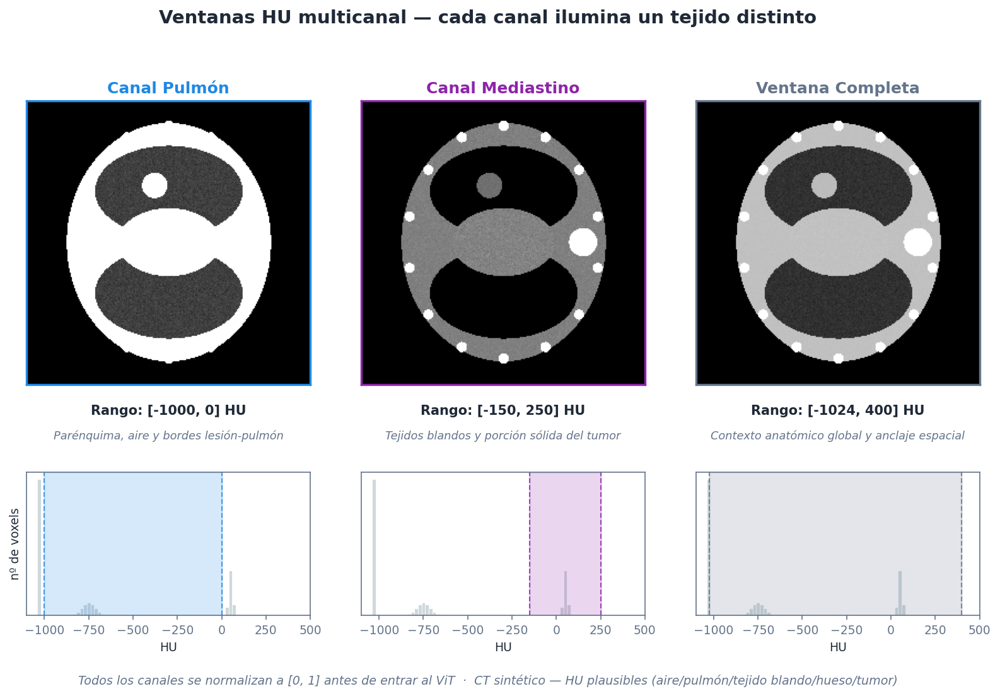
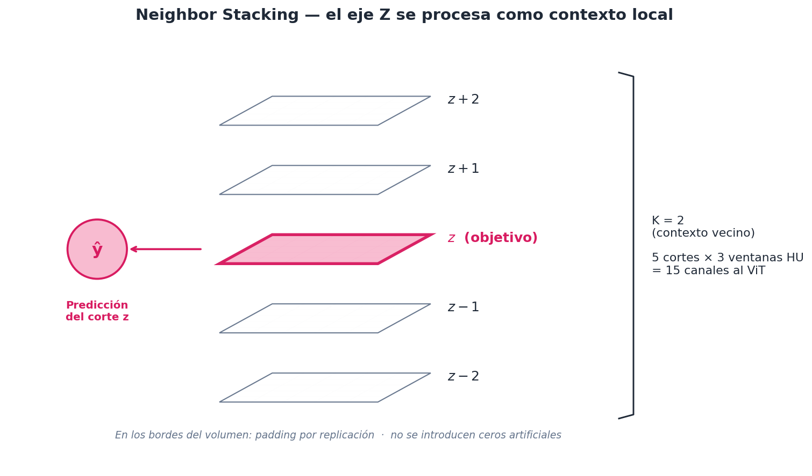
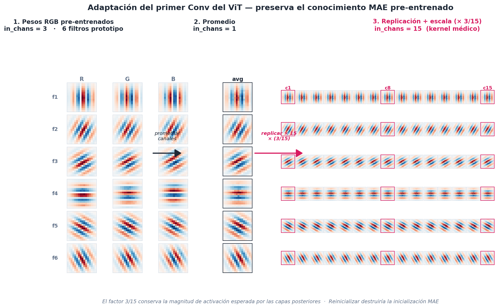
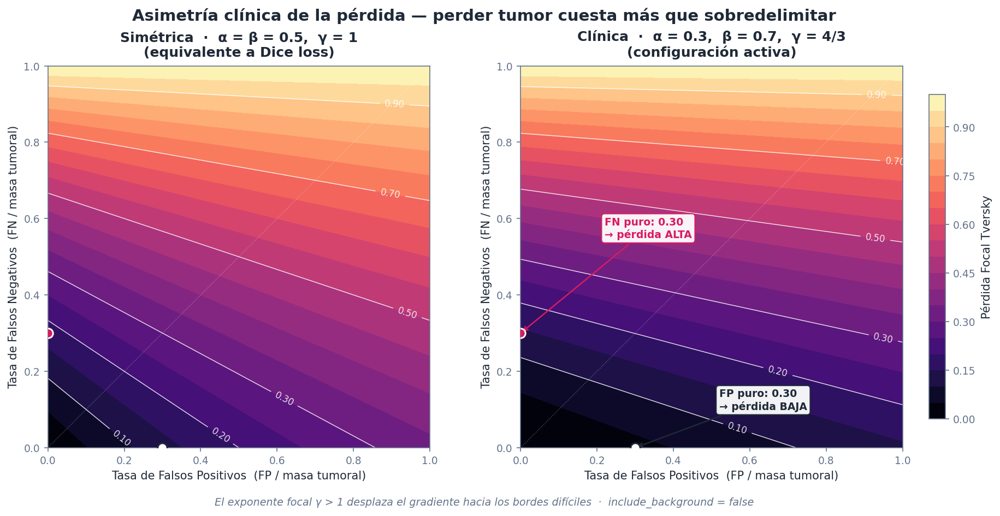
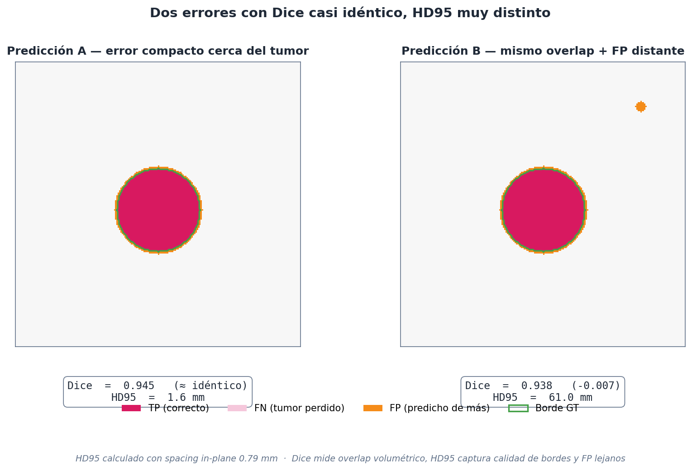
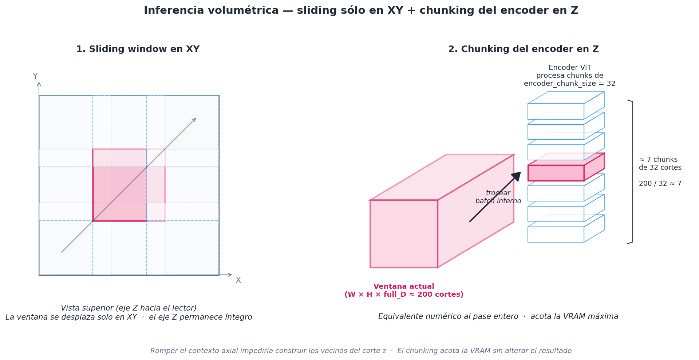

```{=html}
<style>
/* Sin scroll: forzamos que el contenido encaje en cada slide */
.reveal .slides section {
  overflow: hidden !important;
}

/* Diagramas Mermaid centrados y a tamaño del contenedor */
.reveal .cell-output-display .mermaid,
.reveal .cell-output-display svg {
  display: auto;
  margin: 0 auto;
  /* max-height: 70vh; */
}

/* Slide con diagrama a altura completa + columna de texto centrada */
.reveal .columns.fit-diag {
  align-items: center !important;
  justify-content: center;
  height: 100%;
}

.reveal .columns.fit-diag > .column:first-child {
  display: flex;
  flex-direction: column;
  height: 60%;
}
.reveal .columns.fit-diag > .column:first-child .cell-output-display,
.reveal .columns.fit-diag > .column:first-child .cell-output-display svg {
  width: 60%;
  height: 60%;
  max-height: 50vh;
  object-fit: contain;
}

/* Diagrama escalado al 80% (para que no tape texto debajo) */
.reveal .diagram-80 .cell-output-display {
  text-align: center;
}
.reveal .diagram-80 .cell-output-display svg {
  width: 80%;
  height: auto;
  max-height: 60vh;
  margin: 0 auto;
}
</style>
```

## Índice

1. Motivación y objetivo
2. Datos: MSD Task06_Lung
3. Preprocesamiento
4. Arquitectura **ViT25D**
5. Pérdida y entrenamiento
6. Inferencia volumétrica
7. Fase 6: ablación
8. Resultados
9. Discusión y conclusiones

# Motivación y objetivo

## ¿Por qué segmentar tumores pulmonares en CT?

::: {.columns}
::: {.column width="55%"}
- Tarea clave en **diagnóstico**, **planificación radioterápica** y **seguimiento**.
- La delimitación manual es **lenta** y depende del especialista.
- Variabilidad inter-observador ⇒ necesidad de automatización.
- Formulación natural: problema **3D** sobre $(H, W, D)$.
:::
::: {.column width="45%"}
```{mermaid}
flowchart TB
  CT[CT torácico<br/>volumen 3D] --> R[Radiólogo]
  R --> M[Máscara<br/>tumoral]
  M --> P[Planificación<br/>radioterapia]
  M --> S[Seguimiento<br/>respuesta]
  style CT fill:#e3f2fd
  style M fill:#ffebee
```
:::
:::

## El problema de las redes 3D

```{mermaid}
flowchart LR
  V[Volumen<br/>H×W×D] --> N3[Red 3D<br/>UNet3D / VNet]
  N3 --> O[Salida 3D]
  N3 -.->|❌ VRAM| X1[GPU 8 GB<br/>satura]
  N3 -.->|❌ datos| X2[63 casos<br/>no bastan]
  N3 -.->|❌ transferencia| X3[Pre-entrenados<br/>son 2D]
  style X1 fill:#ffcdd2
  style X2 fill:#ffcdd2
  style X3 fill:#ffcdd2
```

> **Pregunta del proyecto:** ¿puede una arquitectura 2D pre-entrenada comportarse como un segmentador volumétrico si se le da contexto local en profundidad?

## Alcance del proyecto

```{mermaid}
flowchart TB
  subgraph Activo[Pipeline activo]
    F4[Fase 4<br/>Segmentación ViT25D]
    F6[Fase 6<br/>Ablación]
  end
  subgraph Contexto[Contexto académico]
    REC[Reconstrucción]
    REG[Registro]
    RAD[Radiómica/Clas.<br/>solo LIDC-IDRI]
  end
  F4 --> F6
  style Activo fill:#c8e6c9
  style Contexto fill:#f5f5f5
```

Reorientamos el proyecto a una **línea principal compacta**: segmentación + ablación. Task06 no tiene etiquetas B/M, así que la clasificación queda fuera.

# Datos

## MSD Task06_Lung

::: {.columns}
::: {.column width="55%"}
- CT torácicos en **NIfTI** + máscaras binarias [@antonelli2022msd; @simpson2019msd].
- **63 casos anotados** + 32 test sin máscara pública.
- Heterogeneidad: tamaño, forma, localización, spacing.
- Toda la validación se hace sobre los 63 anotados.
:::
::: {.column width="45%"}
```{mermaid}
pie title Reparto Task06_Lung
  "Train+Val (etiquetado)" : 63
  "Test (sin máscara)" : 32
```
:::
:::

## Particiones sin fugas

```{mermaid}
flowchart TB
  P[63 pacientes<br/>+ volumen tumoral] --> SGK[StratifiedGroupKFold<br/>k=5]
  SGK --> F0[Fold 0: 50/13]
  SGK --> F1[Fold 1: 51/12]
  SGK --> F2[Fold 2: 50/13]
  SGK --> F3[Fold 3: 51/12]
  SGK --> F4[Fold 4: 50/13]
  style SGK fill:#bbdefb
```

- **Grupo:** `patient_id` ⇒ ningún paciente cae en train *y* val.
- **Estratificación:** terciles de volumen tumoral.

::: {.callout-warning}
Partir por cortes 2D filtraría contexto anatómico → métrica artificialmente inflada.
:::

# Preprocesamiento

## Pipeline de preprocesado

```{mermaid}
flowchart LR
  subgraph G1 [Carga y Orientación]
    direction TB
    L[LoadImaged] --> E[EnsureChannelFirstd]
    E --> O[Orientationd<br/>RAS]
  end
  subgraph G2 [Espaciado y Enfoque]
    direction TB
    S[Spacingd<br/>0.79×0.79×1.24 mm] --> M[MaskNonLungVoxelsd<br/>fuera pulmón → −1024 HU]
    M --> C[CropForegroundd]
  end
  subgraph G3 [Parches y Canales]
    direction TB
    R[RandCropByPosNegLabeld<br/>96×96×16] --> W[MultiWindowHUd<br/>3 ventanas]
  end

  G1 --> G2
  G2 --> G3

  style M fill:#fff9c4
  style W fill:#fff9c4
```

Spacing fijo ⇒ **5 cortes vecinos** equivalen a una distancia anatómica estable entre pacientes.

## Máscara pulmonar como prior anatómico

::: {.columns}
::: {.column width="50%"}
- Pre-cómputo con `lungmask` R231 [@hofmanninger2020lungmask].
- Vóxeles fuera de pulmón → **−1024 HU**.
- El modelo **no malgasta capacidad** descartando regiones extra-pulmonares.
- Estabiliza también `CropForegroundd`.
:::
::: {.column width="50%"}
```{mermaid}
flowchart TB
  CT[CT original] --> LM[lungmask R231]
  LM --> MASK[Máscara<br/>pulmón]
  CT --> APPLY[Aplicar máscara]
  MASK --> APPLY
  APPLY --> OUT[CT con<br/>fondo = aire −1024]
  style MASK fill:#c5e1a5
  style OUT fill:#c5e1a5
```
:::
:::

## Tres ventanas HU como canales

| Canal | Rango HU | Para qué |
|---|---:|---|
| **Pulmón** | $[-1000, 0]$ | Parénquima, bordes lesión-pulmón |
| **Mediastino** | $[-150, 250]$ | Tejidos blandos, tumor sólido |
| **Completa** | $[-1024, 400]$ | Contexto anatómico global |

```{mermaid}
flowchart LR
  HU[CT original<br/>1 canal HU] --> CACHE[(CacheDataset<br/>1 canal)]
  CACHE --> CROP[Crop / patch]
  CROP --> MW[MultiWindowHUd]
  MW --> C3[3 canales<br/>normalizados 0-1]
  style CACHE fill:#e1bee7
  style C3 fill:#c5e1a5
```

Ventanas tras el crop ⇒ caché ligera, no triplica RAM.

## Ventanas HU sobre un corte real

{width=78%}

- **Pulmón** ($[-1000, 0]$): parénquima y bordes lesión-pulmón.
- **Mediastino** ($[-150, 250]$): tumor sólido y tejidos blandos.
- **Completa** ($[-1024, 400]$): contexto anatómico global.

Cada ventana selecciona una franja distinta del histograma → apilarlas evita que el modelo tenga que aprender a comprimir el rango HU.

## Muestreo y aumentación

::: {.columns}
::: {.column width="50%"}
**Muestreo**

- `RandCropByPosNegLabeld`
- Parche **96×96×16**
- Ratio **pos:neg = 3:1**
- El tumor ocupa muy poco volumen ⇒ sin sesgo, los lotes serían casi todo fondo.
:::
::: {.column width="50%"}
**Aumentación `standard`**

- Ruido gaussiano
- Suavizado
- Cambios intensidad/escala
- Rotaciones de 90°
- Flip **solo en Z**

::: {.callout-important}
🚫 `RandFlipd(spatial_axis=0)` **prohibido** — invertir L↔R rompe convenciones anatómicas.
:::
:::
:::

# Arquitectura ViT25D

## La idea: 3D como secuencia de 2D + contexto local

```{mermaid}
%%| fig-align: center
flowchart LR
  subgraph IN["🟦 Entrada volumétrica"]
    direction TB
    V["B × 3 × H × W × D"]
    NS["Neighbor stacking<br/>5 cortes × 3 ventanas<br/>= 15 canales"]
    V --> NS
  end
  subgraph MOD["🟧 Modelo 2D slice-wise"]
    direction TB
    ENC["Encoder ViT-Base<br/>pre-entrenado MAE"]
    DEC["Decoder Conv2D<br/>16× upsample"]
    ENC --> DEC
  end
  subgraph OUT["🟩 Salida volumétrica"]
    REC["B × 2 × H × W × D"]
  end
  IN --> MOD --> OUT
  style V fill:#e3f2fd
  style NS fill:#fff9c4
  style ENC fill:#bbdefb
  style DEC fill:#c5e1a5
  style REC fill:#c8e6c9
```

El eje **Z entra como batch interno**: ningún Conv3D, pero cada corte ve a sus vecinos.

## Neighbor stacking visualmente

```{mermaid}
flowchart LR
  subgraph V[Volumen Z]
    Z0[z-2]
    Z1[z-1]
    Z2[z ★]
    Z3[z+1]
    Z4[z+2]
  end
  Z0 --> S[Stack 5 cortes]
  Z1 --> S
  Z2 --> S
  Z3 --> S
  Z4 --> S
  S --> M[Predicción<br/>del corte z]
  style Z2 fill:#ffcc80
  style M fill:#c5e1a5
```

- $\text{neighbor_context} = 2$ ⇒ **5 cortes** con **3 ventanas HU** = **15 canales**.
- **Padding por replicación** en los bordes (no ceros artificiales).

## Neighbor stacking — vista esquemática

{width=72%}

El contexto axial entra **por la entrada del modelo**, no se infiere a posteriori. Cada predicción nace ya con información de profundidad sin pagar el coste de un Conv3D.

## Encoder ViT pre-entrenado

`vit_base_patch16_224.mae` vía `timm` [@wightman2019timm], pre-entrenado con MAE [@he2022mae].

**Problema:** ViT espera **3 canales RGB**, nosotros tenemos **15**.

```{mermaid}
flowchart LR
  W3[Pesos RGB<br/>Conv 3×16×16] --> AVG[Promediar canales]
  AVG --> REP[Replicar × 15]
  REP --> SCALE[Escalar × 3/15]
  SCALE --> W15[Pesos médicos<br/>Conv 15×16×16]
  style W3 fill:#bbdefb
  style W15 fill:#c5e1a5
```

Se preserva la **distribución inicial de activaciones** y el conocimiento pre-entrenado del primer kernel.

## Pesos del primer Conv: cómo se preserva el MAE

{width=88%}

Reinicializar el `patch_embed` desde aleatorio destruiría la inicialización MAE. Promediar y replicar conserva los detectores de bordes y orientaciones ya aprendidos; el factor $3/15$ mantiene la varianza de activación esperada por las capas posteriores.

## Decoder y supervisión profunda

::: {.columns}
::: {.column width="55%"}
```{mermaid}
flowchart TB
  ENC[Features ViT<br/>14×14] --> B1[ConvT 4×<br/>56×56]
  B1 --> B2[ConvT 2×<br/>112×112]
  B2 --> B3[ConvT 2×<br/>224×224]
  B3 --> H1[Head 1.0]
  B2 --> H2[Head aux 0.5]
  B1 --> H3[Head aux 0.25]
  style H1 fill:#c5e1a5
  style H2 fill:#fff59d
  style H3 fill:#fff59d
```
:::
::: {.column width="45%"}
- Tres bloques: **4× · 2× · 2× = 16×** (compatible con patch size 16).
- Cabezas auxiliares en resoluciones intermedias.
- Pérdida total ponderada:

$$
\mathcal{L} = 1.0\,\mathcal{L}_1 + 0.5\,\mathcal{L}_{1/2} + 0.25\,\mathcal{L}_{1/4}
$$

- La etiqueta se reduce **solo en XY**, el eje Z se conserva.
:::
:::

## Congelación del encoder

```{mermaid}
flowchart TB
  subgraph Frozen[🔒 Encoder MAE - congelado]
    E[ViT-Base<br/>~86M params]
  end
  subgraph Trainable[🔓 Entrenable]
    D[Decoder Conv2D]
    H[3 cabezas]
  end
  E --> D --> H
  style Frozen fill:#ffe0b2
  style Trainable fill:#c5e1a5
```

Por defecto solo entrenan **decoder + cabezas**. Esto reduce VRAM, acelera y evita destruir representaciones útiles con pocos datos.

Si se descongela, el LR del encoder se reduce con `UNFREEZE_LR_FACTOR` (típicamente 0.1).

# Pérdida y entrenamiento

## Focal Tversky Loss

La segmentación tumoral está **muy desbalanceada** [@abraham2019focaltversky]:

$$
TI(P,G)=\frac{TP+\epsilon}{TP+\alpha\, FP+\beta\, FN+\epsilon},\qquad FTL=(1-TI)^\gamma
$$

::: {.columns}
::: {.column width="50%"}
**Configuración activa**

- $\alpha = 0.3,\ \beta = 0.7$ → penaliza más **falsos negativos**
- $\gamma = 4/3$ → exponente focal hacia regiones difíciles
- `include_background = false`
:::
::: {.column width="50%"}
**Por qué $\beta > \alpha$**

> En oncología, **perder parte de una lesión** suele ser peor que sobredelimitar el borde.

El exponente focal desplaza atención hacia bordes irregulares y zonas con densidad parecida al tumor.
:::
:::

## Paisaje de la pérdida Focal Tversky

{width=78%}

A igualdad de magnitud de error, **perder tumor (FN) cuesta más que sobredelimitarlo (FP)**: la pendiente del paisaje es más pronunciada en el eje FN. El exponente focal $\gamma > 1$ inclina aún más la pérdida hacia las zonas difíciles.

## Configuración de entrenamiento (`local_5060`)

::: {.columns}
::: {.column width="50%"}
| Parámetro | Valor |
|---|---:|
| Patch | `96×96×16` |
| Batch size | `1` |
| Grad accumulation | `8` |
| Optimizer | `AdamW` |
| LR | `4e-4` |
| Scheduler | Cosine + warmup |
| Warmup steps | `100` |
| AMP | ✅ |
| Encoder chunk size | `32` |
:::
::: {.column width="50%"}
```{mermaid}
flowchart TB
  H[Hydra config] --> D[data=task06]
  H --> M[model=vit_25d_lung]
  H --> T[training=local_5060]
  H --> E[experiment=phase4_full]
  D --> RUN[Trainer.fit]
  M --> RUN
  T --> RUN
  E --> RUN
  style H fill:#bbdefb
  style RUN fill:#c5e1a5
```

Acumulación de gradiente compensa el batch físico pequeño.
:::
:::

## Validación por volumen completo

```{mermaid}
flowchart LR
  subgraph Train[Entrenamiento]
    P[Parches<br/>96×96×16]
  end
  subgraph Val[Validación]
    V[Volumen<br/>completo]
    PV[predict_volume]
    V --> PV
  end
  P --> LOSS[Focal Tversky]
  PV --> METRICS[Dice + HD95<br/>por paciente]
  style Val fill:#fff9c4
  style METRICS fill:#c5e1a5
```

Entrenar y medir en parches puede ocultar errores de continuidad o componentes falsos lejos del crop. Por eso validamos sobre el volumen entero.

## Métricas: Dice + HD95

::: {.columns}
::: {.column width="50%"}
**Dice de foreground**

$$
\text{Dice} = \frac{2|P \cap G|}{|P| + |G|}
$$

Mide solapamiento volumétrico.
:::
::: {.column width="50%"}
**HD95**

Distancia Hausdorff al **percentil 95**.

Más robusta que Hausdorff máxima ante outliers, captura calidad de **bordes**.
:::
:::

> Dos máscaras pueden tener Dice parecido pero HD95 muy distinto. Monitorizar ambas evita lecturas incompletas.

## Dice y HD95 no miden lo mismo

{width=78%}

- **A:** error pegado al tumor → Dice $0.945$, HD95 = **1.6 mm**.
- **B:** mismo overlap pero un FP lejano → Dice $0.938$, HD95 = **61 mm**.

Por eso reportamos siempre las dos métricas a la vez.

## Checkpoints ligeros

```{mermaid}
flowchart LR
  CKPT_FULL[Checkpoint completo<br/>~348 MB] -.->|Encoder MAE<br/>se reconstruye<br/>desde timm| CKPT_LIGHT[Checkpoint parcial<br/>~12 MB]
  CKPT_LIGHT --> FLAG[model_state_is_partial = True]
  FLAG --> LOAD[Carga con<br/>strict=False]
  style CKPT_FULL fill:#ffcdd2
  style CKPT_LIGHT fill:#c5e1a5
```

Reducción de **>25×** en disco cuando el encoder permanece congelado.

# Inferencia volumétrica

## Sliding window slice-wise

```{mermaid}
%%| fig-align: center
flowchart LR
  subgraph IN["🟦 Entrada"]
    direction TB
    V["Volumen<br/>H × W × D"]
    XY{"Sliding<br/>SOLO en XY<br/>NO en Z"}
    V --> XY
  end
  subgraph WIN["🟧 Por ventana XY"]
    direction TB
    W["Ventana XY +<br/>profundidad completa"]
    NS["Construir vecinos Z"]
    CHUNK["Encoder por chunks<br/>≤ 32 cortes"]
    W --> NS --> CHUNK
  end
  subgraph OUT["🟩 Salida"]
    direction TB
    REC["Recomponer logits"]
    AM["argmax"]
    M["Máscara final"]
    REC --> AM --> M
  end
  IN --> WIN --> OUT
  style V fill:#e3f2fd
  style XY fill:#fff9c4
  style CHUNK fill:#bbdefb
  style M fill:#c8e6c9
```

**Por qué no deslizar en Z:** romper el contexto axial impediría construir los vecinos de cada corte.

## Sliding window XY + chunking en Z (vista)

{width=85%}

Si deslizásemos también en Z, los cortes de los bordes de cada ventana no tendrían vecinos suficientes. El chunking del encoder acota la VRAM **sin alterar el resultado numérico** del forward.

## Chunking del encoder

- Un volumen puede tener **~200 cortes**.
- Pasar todos como batch interno por ViT-Base ⇒ saturación VRAM.
- Trocear en chunks de 32 **no cambia el resultado numérico**, solo limita la memoria máxima.

```{mermaid}
flowchart LR
  S[200 cortes] --> SPLIT[Split en chunks<br/>de 32]
  SPLIT --> C1[chunk 1] --> ENC[ViT]
  SPLIT --> C2[chunk 2] --> ENC
  SPLIT --> CN[chunk N] --> ENC
  ENC --> CAT[Concatenar]
  style ENC fill:#bbdefb
  style CAT fill:#c5e1a5
```

# Fase 6: ablación

## Diseño experimental

```{mermaid}
flowchart LR
  subgraph Factores
    F1[Fracción de datos<br/>0.25 / 0.5 / 1.0]
    F2[Aumentación<br/>none / standard]
    F3[Semilla<br/>0 / 1 / 2]
  end
  Factores --> CELDA[3 × 2 × 3<br/>= 18 runs]
  CELDA --> A[analysis.py]
  A --> CSV[ablation_summary.csv]
  A --> VIO[ablation_violin.png]
  A --> REP[REPORT_ABLATION.md]
  A --> WIL[Wilcoxon pareado]
  style CELDA fill:#bbdefb
  style A fill:#c5e1a5
```

Iteraciones fijas por celda y reducción **estratificada por terciles de volumen tumoral**.

## Tendencias observadas

::: {.columns}
::: {.column width="55%"}
- **100 % de los datos:** `standard` > `none` en mediana Dice **y** reduce HD95.
- **50 %:** mismo patrón con menor margen.
- **25 %:** mediana Dice similar; HD95 mejora con aumentación → **bordes más estables**.
:::
::: {.column width="45%"}
::: {.callout-note}
Con 3 semillas el **Wilcoxon tiene poca potencia**: $p$ no significativo $\neq$ ausencia de efecto.

Lectura: tendencias y estabilidad, no conclusión estadística fuerte.
:::
:::
:::

## Distribución del Dice

{width=78%}

# Resultados

## Curvas de entrenamiento

{width=82%}

Monitorizar Dice **y** HD95: dos máscaras pueden tener Dice parecido y bordes muy distintos.

## Visualización triplanar

{width=78%}

Útil para detectar **discontinuidades**, **fugas a mediastino** y desplazamientos respecto al tumor.

## Mosaico axial

{width=82%}

Criterio visual: la máscara debe **crecer y decrecer suavemente en Z** (efecto del neighbor stacking).

# Ingeniería y reproducibilidad

## Estructura del paquete

```{mermaid}
flowchart TB
  subgraph src/lungseg
    DATA[data/<br/>splits, transforms,<br/>lungmask]
    MODELS[models/<br/>ViT25D]
    TRAIN[training/<br/>trainer, losses]
    INF[inference/<br/>sliding window]
    ABL[ablation/<br/>Fase 6]
    UTILS[utils/<br/>métricas, viz]
  end
  CFG[configs/<br/>Hydra] --> TRAIN
  CFG --> INF
  CFG --> ABL
  MAKE[Makefile] --> TRAIN
  MAKE --> INF
  MAKE --> ABL
  style CFG fill:#bbdefb
  style MAKE fill:#fff9c4
```

Configuración separada de código ⇒ se puede cambiar hardware, modelo o experimento sin tocar `src/`.

## Tests críticos

| Test | Qué protege |
|---|---|
| `test_vit_25d.py` | Shapes, deep supervision, congelación, adaptación de pesos, equivalencia chunking |
| `test_neighbor_stack.py` | Construcción de vecinos y padding por replicación |
| `test_multi_window.py` | Ventanas HU, no mutación de `MetaTensor` |
| `test_transforms.py` | Orden de transforms, prohibición flip L-R |
| `test_lung_mask_transform.py` | Aplicación máscara, errores claros si falta caché |
| `test_splits.py` | Sin solapamiento de pacientes, determinismo |
| `test_phase5_phase6.py` | Contratos ablación, fallo explícito clasificación en Task06 |

# Discusión

## Lo que aporta el 2.5D

```{mermaid}
flowchart LR
  subgraph V2D[2D puro]
    direction TB
    A1[Ningún contexto<br/>en Z]
    A2[Parpadeo<br/>entre cortes]
    A1 ~~~ A2
  end
  subgraph V25D[ViT25D ★]
    direction TB
    B1[Contexto local<br/>en Z]
    B2[Encoder<br/>pre-entrenado]
    B3[Bajo VRAM]
    B1 ~~~ B2 ~~~ B3
  end
  subgraph V3D[3D puro]
    direction TB
    C1[Contexto<br/>completo]
    C2[Sin transferencia<br/>fuerte]
    C3[Alto VRAM]
    C1 ~~~ C2 ~~~ C3
  end
  V2D --> V25D --> V3D
  style V25D fill:#c5e1a5
```

Compromiso razonable entre **contexto volumétrico** y **coste computacional**, alineado con datasets pequeños como Task06.

## Limitaciones

- Contexto en **Z es local**: dependencias largas se capturan solo de forma indirecta.
- El **prior pulmonar** puede ser contraproducente si el tumor invade regiones que `lungmask` excluye.
- 63 casos ⇒ **alta incertidumbre**; hay que reportar por fold y semilla.
- Métricas globales **no capturan todos los errores clínicos** (un FN pequeño en borde puede importar mucho).
- Sin baseline 3D fuerte (**nnU-Net** [@isensee2021nnunet]) bajo el mismo protocolo.

## Validez bajo restricciones de hardware

::: {.columns}
::: {.column width="50%"}
**Restricciones GPU 8 GB**

- Parche reducido
- Batch efectivo modesto
- Menos iteraciones
- 3 semillas
- Exploración de hiperparámetros limitada
- Encoder congelado por defecto
- Checkpoints parciales
:::
::: {.column width="50%"}
**Lectura prudente**

> Los resultados actuales **no son el techo de la arquitectura**, sino una evaluación inicial bajo condiciones ajustadas.

La infraestructura está lista para sustituir artefactos por **ejecuciones completas** cuando haya cómputo.
:::
:::

# Conclusiones

## Cinco ideas que se llevan

::: {.diagram-80}
```{mermaid}
flowchart LR
  I1["1 · Neighbor stacking"] --> R["ViT25D<br/>2.5D pipeline"]
  I2["2 · Tres ventanas HU"] --> R
  I3["3 · Máscara pulmonar prior"] --> R
  I4["4 · MAE adaptado a 15 canales"] --> R
  I5["5 · Focal Tversky FN &gt; FP"] --> R
  R --> O["Flujo MONAI reproducible"]
  style R fill:#c5e1a5
  style O fill:#bbdefb
```
:::

Segmentador 2.5D basado en **ViT pre-entrenado** integrado en un flujo MONAI reproducible, con tests sobre los contratos críticos.

## Trabajo futuro

- Validación **multi-fold completa** + intervalos por bootstrap.
- **Baseline nnU-Net** bajo el mismo protocolo.
- Postprocesado por **componentes conectados**.
- Estudio de **descongelado parcial** del encoder.
- Más semillas y exploración de hiperparámetros con mejor hardware.

##

::: {.r-fit-text}
**¡Gracias!**
:::

::: {style="text-align:center; margin-top:1.5em;"}
Repositorio: `Proyecto_MONAI`

*Francisco Javier Mercader · Chaimae Chahlal · Hiba Chakour*
:::

# Bibliografía

::: {#refs}
:::
